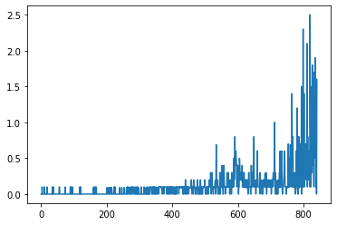
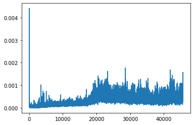
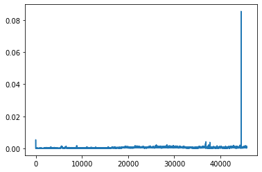
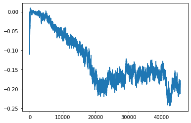
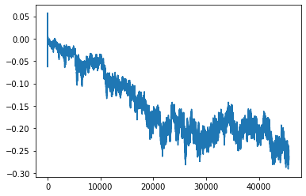

# MADDPG algorithm description

In this project i implemented a variation of multi-agent deep deterministic policy algorithm drawing ideas from "Multi-Agent Actor-Critic for Mixed
Cooperative-Competitive Environments" paper.

MADDPG is an actor-critic algorithm but also uses ideas from value based deep methods(for example DQN) like experience replay buffer and target networks for stabilizing gradient descent. 

In this multi-agent scenario we have 2 agents competing against the other, and every agent has it's own actor neural network and critic neural network , the main idea behind the MADDPG algorithm(and the paper that proposes it) is  that of centralized training-descentralized execution which means that at training time the critics have access to the states and actions of all agents(in this case  2 agents) but  the actor has access only to the local observations of every agent, this has proven to stabilize the multi-agent scenario because in the pure individual mode the environment is not stationary under the point of view and every agent, having a critic with access to both states and actions make training stable .

Both actors and critics(one per agent) have a similar architecture of 2 hidden layers with 128 hidden units each,however there are some differences which it's important to highlight:
* The input size of the actor is the same as the environment observation vector: 24
* The output size of the actor is the same as the numer of posible actions: 2
* The critic has as input states and actions of all agents, thus size is 2(state_size) + 2(action_size) = 2(24) + 2(2) = 52
* The critic has output size = 1, the expected return of the given state and actions.
* The actor has batchnorm layer at it's input and between it's first and second hidden layer, i tried to add batch norm to the critic but it hurt perfomance. 

This method uses a shared "experience replay" buffer storing experience tuples of all agents  and a target network(1 for actor, 1 for critic) which is a previous copy of the corresponding network, i used "hard copy" instead of soft  copy  as in the paper because it provided better results.

## Hyperparameters

| Hyperparameter        | Value           | Comment  |
| ------------- |:-------------:| -----:|
| start epsilon      | 1.0| The agent starts in full exploration mode |
| end epsilon      | 0.01      |   The exploration decay to a limit of 1% meaning it will explore 1% of the time |
| epsilon decay | 0.99125      |    The exploration probability decrases 99.125% every iteration |
| update target network every      | 50 | Target network gets a copy from local network every 50 steps |
| replay buffer size      | 100000      |   How many experience tuples to  store(last observed) |
| train every | 4      |    Trainind is not performed every step but every 4 experience steps |
| batch size      | 32 | A batch of 32 experience tuples is randomly sampled from replay buffer |
| learning rate      | 0.00025      |   a learning rate of 0.00025 is used with an Adam optimizer |
| QNetork hidden layers| 2      |    The Q network has hidden 2 layers |
| Number of hidden units in QNetwork      | 150,150 | every hidden layer las 150 nits|

## Training curves

### Rewards per episode

### Critics losses

### Actors lossess

## Ideas for improving the agents performance

Benchmarking my agent against the expected episodes before completion, the agent is already pretty good(needs aroung 500 episodes, 1800 was the suggested value to expect), still i think there's some ideas than can make it better.

* Apply prioritized experience replay : https://arxiv.org/pdf/1511.05952.pdf
* Apply a dueling network architecture: https://arxiv.org/pdf/1511.06581.pdf
* Do a detailed grid-search for hyperparameters.
* Explore different Q network architecture.

## Future ideas for improvements

DDPG paper showed that many deep value based techniques can be applied to policy based with continous action spaces and i think that some of this value based techniques that are not in the paper but that i have applied before can further improve this policy based agent, for example:

* Prioritized experience replay.
* Double q-learning for reducing overestimation bias.
* Dueling network architecture

Additional to this i think that some recent techniques specific to policy based methods can be experimented like:

* Trust Region Policy Optimization(TRPO)
* Proximal Policy Optimization(PPO)

Besides this, experimentation with hyper-parameter search and different neural network architectures(like adding batch norm to hidden layers) could possibly help.

